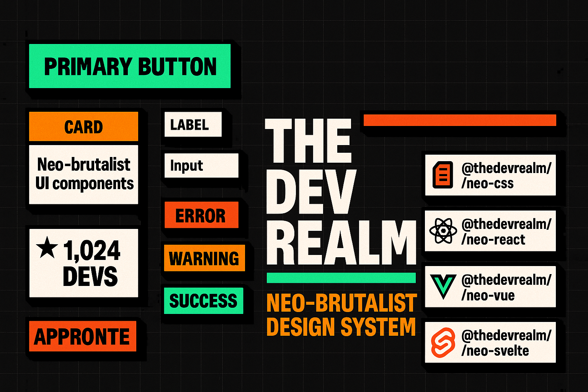

<div align="center">
  
</div>

<div align="center">

# THE DEV REALM — NEO UI

**Bold 3px borders. Hard offset shadows. Uppercase everything. Zero blur, zero apologies.**

A framework-agnostic neo-brutalist design system — one CSS core, four framework adapters.

[](https://www.npmjs.com/package/@thedevrealm/neo-css)
[](https://www.npmjs.com/package/@thedevrealm/neo-react)
[](https://www.npmjs.com/package/@thedevrealm/neo-vue)
[](https://www.npmjs.com/package/@thedevrealm/neo-svelte)
[](LICENSE)

</div>

---

## What Is This?

**The Dev Realm Neo UI** is a production-ready neo-brutalist design system built for developers who are tired of soft, forgettable UIs. It ships as a monorepo with four focused packages — a pure CSS core and native component libraries for React, Vue 3, and Svelte — all sharing the same brutal visual language.

The system is built around a strict set of principles: heavy borders, hard-offset shadows with zero blur, flat bold colours, uppercase headings, and hover interactions that push and pull rather than fade. It's opinionated by design.

### Key Highlights

- **Framework-agnostic core** — `@thedevrealm/neo-css` works in any project via CDN or npm; all other packages build on top of it
- **Four packages, one language** — React, Vue 3, and Svelte adapters expose identical component APIs so teams can mix frameworks freely
- **Tailwind preset** — drop-in preset that maps all neo-brutalist tokens into your Tailwind config
- **Rich component set** — buttons, cards, forms, alerts, tags, badges, stat cards, decorative strips, animated skeletons, and more
- **6-class animation library** — fade-in-up, shimmer, float, gentle bounce, slow ping, and gradient-shift — all CSS, no JS
- **Design tokens** — colour palette, spacing, shadow depths, and border weights all exposed as CSS custom properties
- **Monorepo with pnpm workspaces** — clean publish pipeline; each package versioned independently on npm
- **Portfolio-grade aesthetic** — used across The Dev Realm brand's own products

---

## Packages

| Package | Description | Install |
|---------|-------------|---------|
| [`@thedevrealm/neo-css`](./packages/neo-css) | Core CSS — tokens, component classes, animations | `npm i @thedevrealm/neo-css` |
| [`@thedevrealm/neo-react`](./packages/neo-react) | React component library (TypeScript) | `npm i @thedevrealm/neo-react` |
| [`@thedevrealm/neo-vue`](./packages/neo-vue) | Vue 3 component library | `npm i @thedevrealm/neo-vue` |
| [`@thedevrealm/neo-svelte`](./packages/neo-svelte) | Svelte 4 component library | `npm i @thedevrealm/neo-svelte` |

---

## Design Principles

| Principle | Rule |
|-----------|------|
| **Borders** | Always `3px` solid. Never hairline `1px`. |
| **Corners** | `rounded-md` only. No `rounded-xl` or pill shapes. |
| **Shadows** | Hard offset (`4–6px`), **zero** blur. Never `shadow-lg`. |
| **Typography** | Headings are uppercase, extrabold, tracked wide. |
| **Hover** | Translate up-left, grow shadow. Active pushes down. |
| **Texture** | Grid background + SVG noise overlay globally. |

---

## Quick Start

### 1 · CSS only (any framework)

```html
<!-- CDN -->
<link rel="stylesheet" href="https://unpkg.com/@thedevrealm/neo-css/dist/neo.css" />
```

```html
<button class="neo-btn neo-btn-primary neo-btn-md">CLICK ME</button>
<div class="neo-card" style="padding:1.5rem">Card content</div>
```

### 2 · React

```bash
npm i @thedevrealm/neo-css @thedevrealm/neo-react
```

```tsx
import '@thedevrealm/neo-css/dist/neo.css'
import { NeoButton, NeoCard, NeoAlert, NeoTag } from '@thedevrealm/neo-react'

export default function Demo() {
  return (
    <NeoCard variant="brand" style={{ padding: '1.5rem' }}>
      <NeoTag variant="accent" rotated>Hot</NeoTag>
      <h2>Neo Card</h2>
      <NeoButton variant="primary">Get Started</NeoButton>
      <NeoAlert variant="success" title="Done">Changes saved.</NeoAlert>
    </NeoCard>
  )
}
```

### 3 · Vue 3

```bash
npm i @thedevrealm/neo-css @thedevrealm/neo-vue
```

```ts
// main.ts
import '@thedevrealm/neo-css/dist/neo.css'
import { createApp } from 'vue'
import NeoVue from '@thedevrealm/neo-vue'
import App from './App.vue'

createApp(App).use(NeoVue).mount('#app')
```

```vue
<template>
  <NeoCard variant="brand">
    <NeoButton variant="primary">Click</NeoButton>
    <NeoAlert variant="warning" title="Heads up">Check your settings.</NeoAlert>
  </NeoCard>
</template>
```

### 4 · Svelte

```bash
npm i @thedevrealm/neo-css @thedevrealm/neo-svelte
```

```svelte
<script>
  import '@thedevrealm/neo-css/dist/neo.css'
  import { NeoButton, NeoCard } from '@thedevrealm/neo-svelte'
</script>

<NeoCard variant="brand">
  <NeoButton variant="accent">Boost</NeoButton>
</NeoCard>
```

### 5 · Tailwind CSS preset

```js
// tailwind.config.js
const neoPreset = require('@thedevrealm/neo-css/tailwind-preset')

module.exports = {
  presets: [neoPreset],
  content: ['./src/**/*.{html,js,ts,jsx,tsx,vue,svelte}'],
}
```

---

## CSS Class Reference

### Buttons

| Class | Description |
|-------|-------------|
| `neo-btn` | Base button (required) |
| `neo-btn-primary` | Emerald green primary |
| `neo-btn-accent` | Amber accent |
| `neo-btn-ghost` | Outlined ghost |
| `neo-btn-danger` | Red danger |
| `neo-btn-sm` / `neo-btn-md` / `neo-btn-lg` | Size modifiers |

### Cards

| Class | Description |
|-------|-------------|
| `neo-card` | Standard card — border + hard shadow |
| `neo-card-brand` | Card with green top bar |
| `neo-card-pattern` | Reveals micro-grid on hover |
| `neo-stat-card` | Stat display card |
| `neo-filter-card` | Toolbar / filter panel |
| `neo-star` | Adds ★ decorator in top-right |

### Tags & Badges

| Class | Description |
|-------|-------------|
| `neo-tag` + `neo-tag-brand/accent/ghost` | Small label tag |
| `neo-tag-rotate` | Adds slight rotation |
| `neo-badge` + `neo-badge-default/success/warning/error` | Inline status badge |

### Forms

| Class | Description |
|-------|-------------|
| `neo-input` | Text input / textarea |
| `neo-select` | Select dropdown |
| `neo-label` | Field label |
| `neo-field` | Label + input wrapper |
| `neo-input-icon` | Icon + input wrapper |

### Alerts

| Class | Description |
|-------|-------------|
| `neo-alert` + `neo-alert-success/warning/error/info` | Alert banner |

### Decorative

| Class | Description |
|-------|-------------|
| `neo-header-bar` | Diagonal-stripe branded strip |
| `neo-divider` | Dashed divider with ✂ |
| `neo-stripe-pattern` | Diagonal stripe texture |
| `neo-price` | Large price number with amber underline |
| `neo-text-gradient` | Emerald gradient text |
| `neo-text-gradient-hero` | Emerald → amber gradient |

### Animations

| Class | Description |
|-------|-------------|
| `animate-neo-fade-in-up` | Fade + slide up on mount |
| `animate-neo-shimmer` | Shimmer loading skeleton |
| `animate-neo-float` | Gentle up-down float |
| `animate-neo-bounce-gentle` | Gentle bounce |
| `animate-neo-ping-slow` | Slow ping / beacon pulse |
| `animate-neo-gradient-shift` | Animated gradient text |

---

## Monorepo Development

This repo uses **pnpm workspaces**.

```bash
# Install all deps
pnpm install

# Build all packages
pnpm build

# Build a single package
pnpm --filter @thedevrealm/neo-css build
pnpm --filter @thedevrealm/neo-react build
```

### Publishing to npm

```bash
pnpm build

pnpm --filter @thedevrealm/neo-css    publish --access public
pnpm --filter @thedevrealm/neo-react  publish --access public
pnpm --filter @thedevrealm/neo-vue    publish --access public
pnpm --filter @thedevrealm/neo-svelte publish --access public
```

---

## Project Structure

```
thedevrealm-ui/
├── packages/
│   ├── neo-css/          # Core CSS tokens, classes, animations
│   │   ├── src/
│   │   ├── dist/         # Built output (neo.css)
│   │   └── tailwind-preset.js
│   ├── neo-react/        # React component library (TypeScript)
│   ├── neo-vue/          # Vue 3 component library
│   └── neo-svelte/       # Svelte 4 component library
├── docs/                 # Design system documentation
├── assets/               # Repo assets (banner etc.)
├── package.json          # Monorepo root
└── pnpm-workspace.yaml
```

---

## License

MIT — © The Dev Realm
